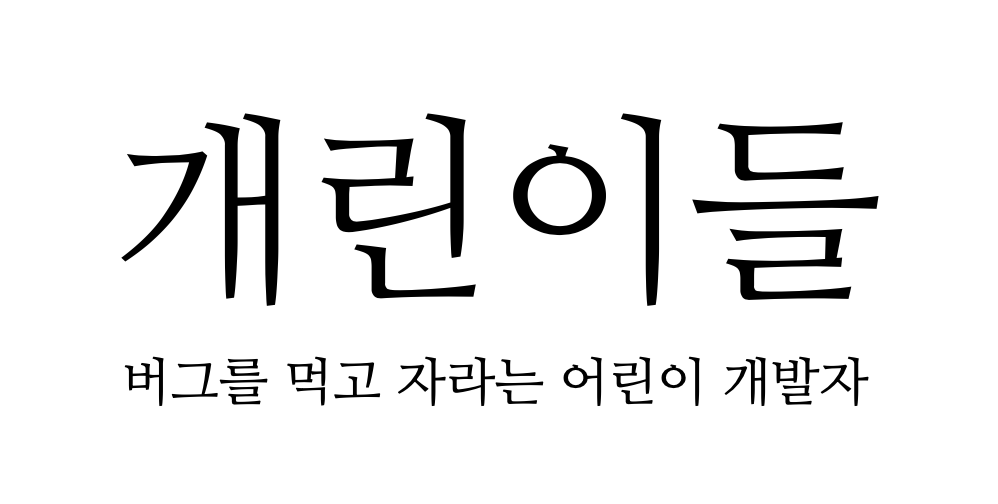
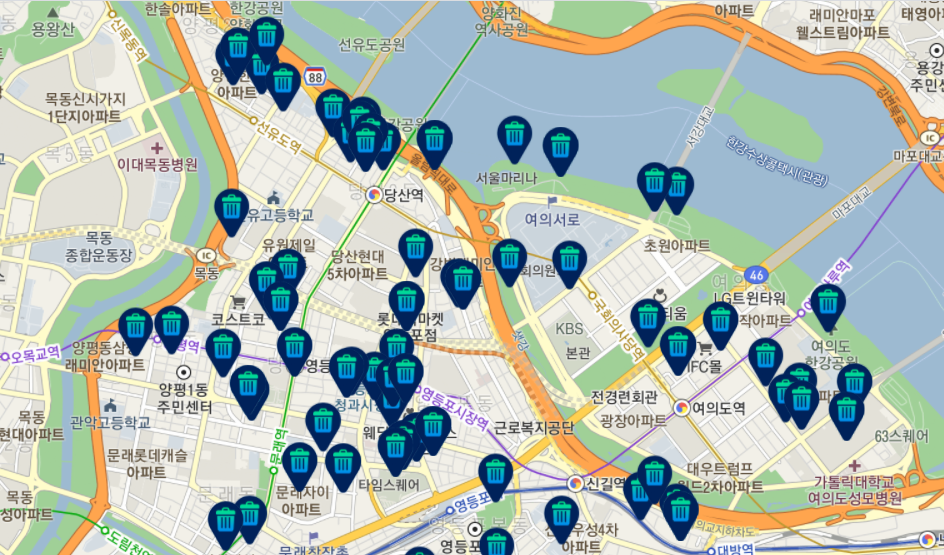

    <h4>SM Maestro 12th</h4>
    <h3>Hackathon Team-13 개린이들<h3>
    

# 여기 어때? 여기 버려!
## 공공데이터를 이용한 쓰레기통 찾기

- [쓰레기통을 찾아서](#find-trash)
- [주요기능](#features)
    - [쓰레기통 갖고 온나](#give-me-trash-can)
    - [가장 가까운 쓰레기통](#shortest-trash-can)
    - [더 가까우면, 더 진해요](#near-then-real)
    - [쓰레기통을 향한 모험](#trip-to-can)
    - [곧 서울을 정복하리라](#conquer-seoul)
- [개린이들 팀원](#team)
- [프로젝트 지원](#support)
- [Copyright](#copyright)

---

# 🗑️ 쓰레기통을 찾아서 🗑️

    

길을 걷다가 쓰레기통을 찾지 못해 계속 들고다니거나, 길거리에 쌓인 쓰레기봉투에 꾸겨 넣은 적이 있지 않나요?

### 쓰레기는 쓰레기통에! 근데 쓰레기통은 어디에?
### 여기 어때? 여기 버려!

---

# 주요기능 🚮 

## 쓰레기통 갖고 온나
쓰레기통이 있는 곳에 핀이 찍힙니다.

    

## 가장 가까운 쓰레기통
현재 위치에서 가장 가까운 쓰레기통의 위치를 보여줍니다. 물론 임의의 위치도 지정할 수 있고요!

[[ image ]]

## 더 가까우면면, 더 진해요
현재 위치에서 가까운 쓰레기통일수록 더 진하게 보입니다. 흐린 쓰레기통은 멀리 있어요!

[[ image ]]

## 쓰레기통을 향한 모험
선택한 쓰레기통으로 경로 안내를 받을 수 있어요.

[[ image ]]

## 곧 서울을 정복하리라
현재는 영등포구의 쓰레기통만 지원하고 있어요. 조만간 영등포구를 넘어 서울을 정복할 겁니다!

[[ image ]]

---

# 🤷‍♂️🤷‍♂️🤷‍♀ 개린이들 팀원 🤷‍🤷‍♂️🤷‍♂️
### Hackaton Team 13

- 전민수 / 팀장
    - Email : minsu2530@u.sogang.ac.kr
    - Github : [bambbam](https://github.com/bambbam)
- 강문해
    - Email : tjdnf2eoeld@naver.com
    - Github : [airplane9876](https://github.com/airplane9876) 
- 김태호
    - Email : ting_916@naver.com
    - Github : [Ting-Kim](https://github.com/Ting-Kim)
- 박경원
    - Email : kwpark96@naver.com
    - Github : [W0nee](https://github.com/W0nee)
- 이도원
    - Email : dwon424@gmail.com
    - Github : [2dowon](https://github.com/2dowon)
- 정기웅
    - Email : answeqr@gmail.com
    - Github : [QuqqU](https://github.com/QuqqU)

--- 

# 프로젝트 지원 💸

> 이 성과는 2021년도 과학기술정보통신부의 재원으로 정보통신기획평가원의 지원을 받아 수행된 연구임(IITP-0000-SW마에스트로과정).   
This work was supported by the Institute of Information & Communications Technology Planning & Evaluation(IITP) grant funded
by the Ministry of Science and ICT(MSIT) (IITP-0000-SW Maestro training course).

---

# Copyright ©
Copyright 2021. (Team. 개린이들) All rights reserved.